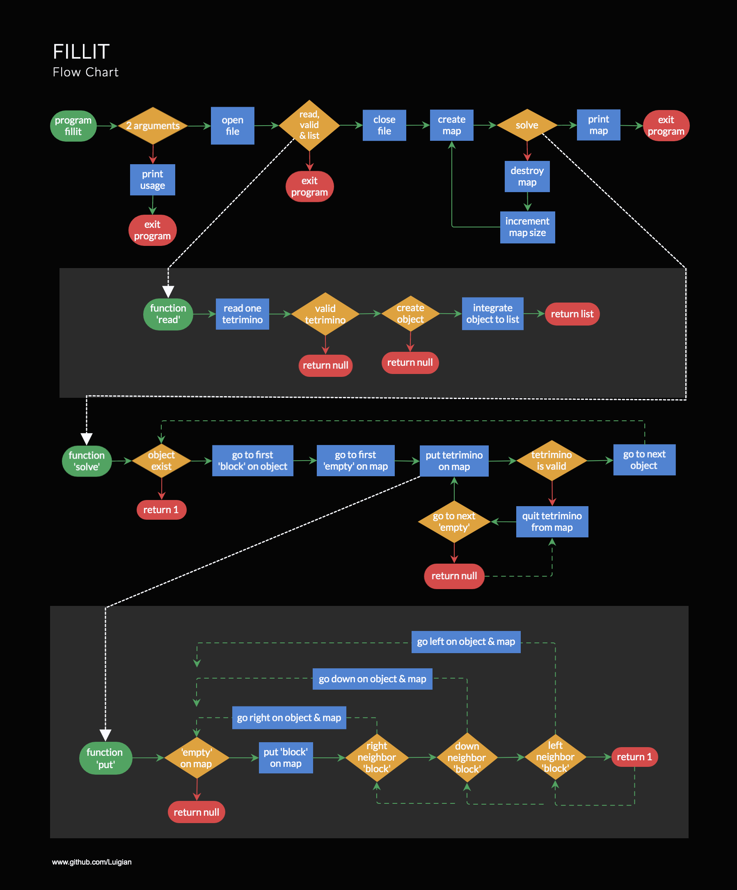
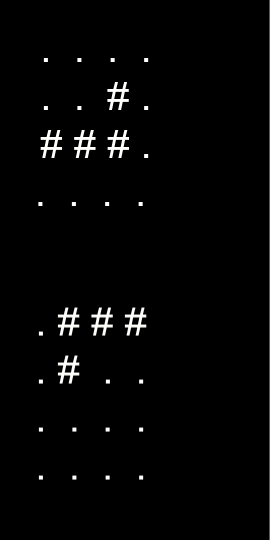

# Fillit

In this project i created a program called `fillit` wich allow you to take as a parameter a file wich contains a list from 1 to 26 pieces of tetriminos and display, on the standard output, all of them assembled together in the smallest possible square, assigning a capital letter to each tetrimino, starting with ’A’. The main goal is to find the smallest square in the minimal amount of time, despite an exponentially growing number of possibilities each time a piece is added.

### Flowchart:

### Input:

### Output:

### Key points:

* Functions `open`, `read`, `close` and buff size adaptation.
* Utilization of temporal variables.
* Static variables.
* Proper allocation and destruction of heap memory.
* Managing multiple file descriptors.

### Objectives:

* Basic algorithm. 
* Entries / exits.

### Skills:
 
* Algorithms & AI.
* Rigor.
* Unix.
* Group & interpersonal

### Compilation:

`make all` | First time compilation.

`make fclean` | Delete files generated from compilation.

`make re` | Delete files generated from compilation and recompile.

### Execution:

`./fillit 'source_file'` | Solve from a single file.
