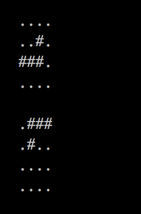

# Fillit

In this project i created a function called `get_next_line` wich allow you to read content line by line from a file descriptor (whether a file, standard input, or even later a network connection). Calling it in a loop will read one line at a time until the end of the text.

### Flowchart:

### Input:

### Output:

### Key points:

* Functions `open`, `read`, `close` and buff size adaptation.
* Utilization of temporal variables.
* Static variables.
* Proper allocation and destruction of heap memory.
* Managing multiple file descriptors.

### Objectives:

* Filedescriptors. 
* Buffering.
* Basic parsing. 

### Skills:

* Imperative programming.
* Rigor.
* Algorithms & AI.

### Compilation:

`make all` | First time compilation.

`make fclean` | Delete files generated from compilation.

`make re` | Delete files generated from compilation and recompile.

### Execution:

`./test_gnl` | Read from Standard Input.

`./test_gnl "file_path"` | Read from a single file.

`./test_gnl "file_path_1" "file_path_2" "file_path_3"` | Read from multiple files.

`./test_gnl "file_path_1" "file_path_2" "file_path_3" mix n` | Read n lines from multiple files.

### Returning values:

`1` | Line read.

`0` | No read, end of file.

`-1` | Error.
